# Database Schema Documentation

This document provides a comprehensive overview of the database structure for the Online Democratic Republic application.

## Entity Relationship Diagram

```mermaid
erDiagram
    users ||--o{ parties : "leads (leader_id)"
    users }o--|| parties : "member of (party_id)"
    users ||--o{ bills : "creates"
    users ||--o{ candidates : "runs as"
    users ||--o{ votes : "casts"
    users ||--o{ bill_votes_house : "votes on"
    users ||--o{ bill_votes_senate : "votes on"
    users ||--o{ bill_votes_presidential : "votes on"
    users ||--o{ feed : "posts"
    users ||--o{ chats : "sends"

    parties ||--o{ party_stances : "has"
    parties ||--o{ party_notifications : "sends (sender_party_id)"
    parties ||--o{ party_notifications : "receives (receiver_party_id)"

    political_stances ||--o{ party_stances : "used in"
    political_stances ||--o{ merge_request_stances : "used in"

    elections ||--o{ candidates : "has"
    elections ||--o{ votes : "receives"
    candidates ||--o{ votes : "voted for"

    bills ||--o{ bill_votes_house : "receives"
    bills ||--o{ bill_votes_senate : "receives"
    bills ||--o{ bill_votes_presidential : "receives"

    merge_request ||--o{ party_notifications : "notifies"
    merge_request ||--o{ merge_request_stances : "has"

    users {
        int id PK
        string email UK
        string username UK
        text bio
        string political_leaning
        string role
        int party_id FK
        timestamp created_at
    }

    parties {
        int id PK
        int leader_id FK
        string name UK
        string color
        text bio
        string political_leaning
        string leaning
        string logo
        timestamp created_at
    }

    political_stances {
        int id PK
        string issue
        string description
    }

    party_stances {
        int party_id FK
        int stance_id FK
        string value
    }

    elections {
        string election PK
        string status
        int seats
        int days_left
    }

    candidates {
        int id PK
        int user_id FK
        string election FK
        int votes
        boolean hasWon
    }

    votes {
        int id PK
        int user_id FK
        string election FK
        int candidate_id FK
    }

    bills {
        int id PK
        string status
        string stage
        string title
        int creator_id FK
        text content
        int pool
        timestamp created_at
    }

    bill_votes_house {
        int id PK
        int bill_id FK
        int voter_id FK
        boolean vote_yes
    }

    bill_votes_senate {
        int id PK
        int bill_id FK
        int voter_id FK
        boolean vote_yes
    }

    bill_votes_presidential {
        int id PK
        int bill_id FK
        int voter_id FK
        boolean vote_yes
    }

    feed {
        int id PK
        int user_id FK
        text content
        timestamp created_at
    }

    chats {
        int id PK
        int user_id FK
        string room
        string username
        text message
        timestamp created_at
    }

    merge_request {
        int id PK
        int leader_id
        string name
        string color
        text bio
        string political_leaning
        string leaning
        string logo
        timestamp created_at
    }

    party_notifications {
        int sender_party_id FK
        int receiver_party_id FK
        int merge_request_id FK
        timestamp created_at
        string status
    }

    merge_request_stances {
        int id PK
        int merge_request_id FK
        int stance_id FK
        text value
    }

    game_tracker {
        int id PK
        int bill_pool
    }
```

## Tables Overview

### Core Tables

#### users

The central user table containing all registered users of the system.

| Column            | Type         | Constraints               | Description                                |
| ----------------- | ------------ | ------------------------- | ------------------------------------------ |
| id                | SERIAL       | PRIMARY KEY               | Auto-incrementing user identifier          |
| email             | VARCHAR(255) | UNIQUE, NOT NULL          | User's email address                       |
| username          | VARCHAR(255) | UNIQUE, NOT NULL          | User's display name                        |
| bio               | TEXT         | -                         | User biography                             |
| political_leaning | VARCHAR(50)  | -                         | User's political orientation               |
| role              | VARCHAR(50)  | DEFAULT 'Representative'  | User's role in the government              |
| party_id          | INT          | FOREIGN KEY → parties(id) | Reference to the party the user belongs to |
| created_at        | TIMESTAMP    | DEFAULT CURRENT_TIMESTAMP | Account creation timestamp                 |

**Foreign Keys:**

- `party_id` → `parties(id)` ON DELETE SET NULL

#### parties

Political parties that users can join and lead.

| Column            | Type         | Constraints               | Description                        |
| ----------------- | ------------ | ------------------------- | ---------------------------------- |
| id                | SERIAL       | PRIMARY KEY               | Auto-incrementing party identifier |
| leader_id         | INT          | FOREIGN KEY → users(id)   | Reference to the party leader      |
| name              | VARCHAR(255) | UNIQUE, NOT NULL          | Party name                         |
| color             | VARCHAR(7)   | NOT NULL                  | Party color (hex code)             |
| bio               | TEXT         | -                         | Party description                  |
| political_leaning | VARCHAR(50)  | -                         | Overall political orientation      |
| leaning           | VARCHAR(25)  | -                         | Specific political leaning         |
| logo              | VARCHAR(100) | -                         | Lucide icon name for party logo    |
| created_at        | TIMESTAMP    | DEFAULT CURRENT_TIMESTAMP | Party creation timestamp           |

**Foreign Keys:**

- `leader_id` → `users(id)` ON DELETE SET NULL

#### political_stances

Predefined political issues that parties take stances on.

| Column      | Type         | Constraints | Description                              |
| ----------- | ------------ | ----------- | ---------------------------------------- |
| id          | SERIAL       | PRIMARY KEY | Auto-incrementing stance type identifier |
| issue       | VARCHAR(100) | NOT NULL    | The political issue/question             |
| description | VARCHAR(255) | NOT NULL    | Description or examples of the issue     |

#### party_stances

Junction table linking parties to their positions on various political issues.

| Column    | Type          | Constraints                         | Description                      |
| --------- | ------------- | ----------------------------------- | -------------------------------- |
| party_id  | INT           | FOREIGN KEY → parties(id)           | Reference to the party           |
| stance_id | INT           | FOREIGN KEY → political_stances(id) | Reference to the political issue |
| value     | VARCHAR(1024) | NOT NULL                            | Party's position on this issue   |

**Foreign Keys:**

- `party_id` → `parties(id)`
- `stance_id` → `political_stances(id)`

### Election System

#### elections

Active elections in the system.

| Column    | Type        | Constraints                   | Description                            |
| --------- | ----------- | ----------------------------- | -------------------------------------- |
| election  | VARCHAR(50) | PRIMARY KEY                   | Election type (President, Senate)      |
| status    | VARCHAR(50) | NOT NULL, DEFAULT 'Candidacy' | Current election phase                 |
| seats     | INTEGER     | -                             | Number of seats available (for Senate) |
| days_left | INTEGER     | NOT NULL                      | Days remaining in current phase        |

#### candidates

Users who are running in elections.

| Column   | Type        | Constraints                       | Description                             |
| -------- | ----------- | --------------------------------- | --------------------------------------- |
| id       | SERIAL      | PRIMARY KEY                       | Auto-incrementing candidate identifier  |
| user_id  | INT         | FOREIGN KEY → users(id)           | Reference to the user running           |
| election | VARCHAR(50) | FOREIGN KEY → elections(election) | Election they're running in             |
| votes    | INTEGER     | DEFAULT 0                         | Number of votes received                |
| hasWon   | BOOLEAN     | DEFAULT NULL                      | Whether candidate won (NULL if ongoing) |

**Foreign Keys:**

- `user_id` → `users(id)`
- `election` → `elections(election)`

**Constraints:**

- UNIQUE(user_id, election) - Users can only run once per election

#### votes

Records of users' votes in elections. For Senate elections, users can cast multiple votes (up to the number of available seats), one for each candidate they support.

| Column       | Type        | Constraints                       | Description                        |
| ------------ | ----------- | --------------------------------- | ---------------------------------- |
| id           | SERIAL      | PRIMARY KEY                       | Auto-incrementing vote identifier  |
| user_id      | INT         | FOREIGN KEY → users(id)           | User who voted                     |
| election     | VARCHAR(50) | FOREIGN KEY → elections(election) | Election they voted in             |
| candidate_id | INT         | FOREIGN KEY → candidates(id)      | Specific candidate being voted for |

**Foreign Keys:**

- `user_id` → `users(id)`
- `election` → `elections(election)`
- `candidate_id` → `candidates(id)` ON DELETE CASCADE

**Constraints:**

- UNIQUE(user_id, election, candidate_id) - Users can only vote once per candidate per election

**Voting Rules:**

- For Presidential elections: Users can cast 1 vote total
- For Senate elections: Users can cast multiple votes (up to the number of `seats` available in the election), but only 1 vote per candidate

### Legislative System

#### bills

Proposed legislation moving through the system.

| Column     | Type         | Constraints                | Description                                |
| ---------- | ------------ | -------------------------- | ------------------------------------------ |
| id         | SERIAL       | PRIMARY KEY                | Auto-incrementing bill identifier          |
| status     | VARCHAR(50)  | NOT NULL, DEFAULT 'Queued' | Current bill status (Queued, Voting, etc.) |
| stage      | VARCHAR(50)  | NOT NULL, DEFAULT 'House'  | Current legislative stage                  |
| title      | VARCHAR(255) | NOT NULL                   | Bill title                                 |
| creator_id | INTEGER      | FOREIGN KEY → users(id)    | User who created the bill                  |
| content    | TEXT         | NOT NULL                   | Bill content/text                          |
| pool       | INTEGER      | -                          | Bill pool for game mechanics               |
| created_at | TIMESTAMP    | DEFAULT CURRENT_TIMESTAMP  | Bill creation timestamp                    |

**Foreign Keys:**

- `creator_id` → `users(id)`

#### bill_votes_house

House of Representatives votes on bills.

| Column   | Type    | Constraints             | Description                       |
| -------- | ------- | ----------------------- | --------------------------------- |
| id       | SERIAL  | PRIMARY KEY             | Auto-incrementing vote identifier |
| bill_id  | INTEGER | FOREIGN KEY → bills(id) | Bill being voted on               |
| voter_id | INTEGER | FOREIGN KEY → users(id) | User casting the vote             |
| vote_yes | BOOLEAN | NOT NULL                | True for yes, false for no        |

**Foreign Keys:**

- `bill_id` → `bills(id)`
- `voter_id` → `users(id)`

#### bill_votes_senate

Senate votes on bills.

| Column   | Type    | Constraints             | Description                       |
| -------- | ------- | ----------------------- | --------------------------------- |
| id       | SERIAL  | PRIMARY KEY             | Auto-incrementing vote identifier |
| bill_id  | INTEGER | FOREIGN KEY → bills(id) | Bill being voted on               |
| voter_id | INTEGER | FOREIGN KEY → users(id) | User casting the vote             |
| vote_yes | BOOLEAN | NOT NULL                | True for yes, false for no        |

**Foreign Keys:**

- `bill_id` → `bills(id)`
- `voter_id` → `users(id)`

#### bill_votes_presidential

Presidential approval/veto on bills.

| Column   | Type    | Constraints             | Description                       |
| -------- | ------- | ----------------------- | --------------------------------- |
| id       | SERIAL  | PRIMARY KEY             | Auto-incrementing vote identifier |
| bill_id  | INTEGER | FOREIGN KEY → bills(id) | Bill being voted on               |
| voter_id | INTEGER | FOREIGN KEY → users(id) | President casting the vote        |
| vote_yes | BOOLEAN | NOT NULL                | True for approve, false for veto  |

**Foreign Keys:**

- `bill_id` → `bills(id)`
- `voter_id` → `users(id)`

### Party Merger System

#### merge_request

Proposed merged parties when two parties want to combine.

| Column            | Type         | Constraints               | Description                                |
| ----------------- | ------------ | ------------------------- | ------------------------------------------ |
| id                | SERIAL       | PRIMARY KEY               | Auto-incrementing merge request identifier |
| leader_id         | INT          | -                         | Proposed leader of merged party            |
| name              | VARCHAR(255) | NOT NULL                  | Proposed name for merged party             |
| color             | VARCHAR(7)   | NOT NULL                  | Proposed color for merged party            |
| bio               | TEXT         | -                         | Proposed bio for merged party              |
| political_leaning | VARCHAR(50)  | NOT NULL                  | Proposed political leaning                 |
| leaning           | VARCHAR(25)  | NOT NULL                  | Proposed specific leaning                  |
| logo              | VARCHAR(100) | -                         | Proposed logo for merged party             |
| created_at        | TIMESTAMP    | DEFAULT CURRENT_TIMESTAMP | Merge request creation timestamp           |

#### party_notifications

Notifications for party merge requests between parties.

| Column            | Type        | Constraints                                  | Description                         |
| ----------------- | ----------- | -------------------------------------------- | ----------------------------------- |
| sender_party_id   | INTEGER     | PRIMARY KEY, FOREIGN KEY → parties(id)       | Party sending the merge request     |
| receiver_party_id | INTEGER     | PRIMARY KEY, FOREIGN KEY → parties(id)       | Party receiving the merge request   |
| merge_request_id  | INTEGER     | PRIMARY KEY, FOREIGN KEY → merge_request(id) | The merge request details           |
| created_at        | TIMESTAMP   | DEFAULT CURRENT_TIMESTAMP                    | Notification creation timestamp     |
| status            | VARCHAR(20) | NOT NULL, DEFAULT 'Pending'                  | Status: Pending, Accepted, Rejected |

**Foreign Keys:**

- `sender_party_id` → `parties(id)` ON DELETE CASCADE
- `receiver_party_id` → `parties(id)` ON DELETE CASCADE
- `merge_request_id` → `merge_request(id)` ON DELETE CASCADE

**Constraints:**

- PRIMARY KEY(sender_party_id, receiver_party_id, merge_request_id)

#### merge_request_stances

Political stances for the proposed merged party.

| Column           | Type    | Constraints                         | Description                            |
| ---------------- | ------- | ----------------------------------- | -------------------------------------- |
| id               | SERIAL  | PRIMARY KEY                         | Auto-incrementing stance identifier    |
| merge_request_id | INTEGER | FOREIGN KEY → merge_request(id)     | The merge request                      |
| stance_id        | INTEGER | FOREIGN KEY → political_stances(id) | The political issue                    |
| value            | TEXT    | -                                   | Proposed stance value for merged party |

**Foreign Keys:**

- `merge_request_id` → `merge_request(id)` ON DELETE CASCADE
- `stance_id` → `political_stances(id)` ON DELETE CASCADE

### Social Features

#### feed

Activity feed showing user actions.

| Column     | Type      | Constraints               | Description                            |
| ---------- | --------- | ------------------------- | -------------------------------------- |
| id         | SERIAL    | PRIMARY KEY               | Auto-incrementing feed item identifier |
| user_id    | INTEGER   | FOREIGN KEY → users(id)   | User who performed the action          |
| content    | TEXT      | NOT NULL                  | Description of the action              |
| created_at | TIMESTAMP | DEFAULT CURRENT_TIMESTAMP | Action timestamp                       |

**Foreign Keys:**

- `user_id` → `users(id)`

#### chats

Chat messages in various rooms (party chat, etc.).

| Column     | Type         | Constraints               | Description                          |
| ---------- | ------------ | ------------------------- | ------------------------------------ |
| id         | SERIAL       | PRIMARY KEY               | Auto-incrementing message identifier |
| user_id    | INTEGER      | FOREIGN KEY → users(id)   | User who sent the message            |
| room       | VARCHAR(255) | NOT NULL                  | Chat room identifier                 |
| username   | VARCHAR(255) | NOT NULL                  | Denormalized username for display    |
| message    | TEXT         | NOT NULL                  | Message content                      |
| created_at | TIMESTAMP    | DEFAULT CURRENT_TIMESTAMP | Message timestamp                    |

**Foreign Keys:**

- `user_id` → `users(id)`

### Game Mechanics

#### game_tracker

Singleton table tracking game state.

| Column    | Type    | Constraints         | Description                                           |
| --------- | ------- | ------------------- | ----------------------------------------------------- |
| id        | SERIAL  | PRIMARY KEY         | Auto-incrementing identifier (should only have 1 row) |
| bill_pool | INTEGER | NOT NULL, DEFAULT 1 | Current bill pool number                              |

## Key Relationships

### User Relationships

- A user can **belong to** one party (many-to-one)
- A user can **lead** one party (one-to-one)
- A user can **create** many bills (one-to-many)
- A user can **run as** many candidates (one-to-many)
- A user can **cast** many votes (one-to-many)
  - For Senate elections: up to N votes (where N = number of seats)
  - For Presidential elections: 1 vote only

### Party Relationships

- A party **has** one leader (one-to-one with users)
- A party **has** many members (one-to-many with users)
- A party **has** many stances (one-to-many with party_stances)
- A party can **send** many merge requests (one-to-many with party_notifications)
- A party can **receive** many merge requests (one-to-many with party_notifications)

### Bill Lifecycle

1. Bill created by user → `bills` table
2. Bill enters voting pool → `pool` field set
3. Representatives vote → `bill_votes_house` table
4. If passed, Senators vote → `bill_votes_senate` table
5. If passed, President votes → `bill_votes_presidential` table

### Party Merger Flow

1. Party leader creates merge request → `merge_request` table
2. Merge request stances defined → `merge_request_stances` table
3. Notification sent to target party → `party_notifications` table
4. Target party leader accepts or rejects
5. If accepted:
   - New party created with merge request data
   - All members transferred to new party
   - Old parties deleted

## Indexes and Performance Considerations

### Recommended Indexes

- `users(email)` - UNIQUE index for login lookups
- `users(username)` - UNIQUE index for profile lookups
- `users(party_id)` - Foreign key index for party member queries
- `parties(leader_id)` - Foreign key index for leader lookups
- `bills(status, stage)` - Composite index for filtering active bills
- `party_notifications(receiver_party_id, status)` - Composite index for pending notifications
- `chats(room, created_at)` - Composite index for chat history queries
- `feed(created_at)` - Index for chronological feed queries

### Cascade Behaviors

- When a party is deleted, all party_stances are deleted (no CASCADE defined, orphaned records)
- When a party is deleted, party_notifications are CASCADE deleted
- When a merge_request is deleted, merge_request_stances are CASCADE deleted
- When a user's party is deleted, their party_id is SET NULL
- When a party's leader leaves, leader_id is SET NULL

## Data Integrity Rules

1. **Users cannot belong to non-existent parties** - Enforced by FOREIGN KEY constraint
2. **Each user can only vote once per candidate per election** - Enforced by UNIQUE constraint on (user_id, election, candidate_id)
3. **Users cannot exceed the vote limit for an election** - Enforced by application logic (limit = number of seats)
4. **Each user can only run once per election** - Enforced by UNIQUE constraint
5. **Party names must be unique** - Enforced by UNIQUE constraint
6. **Email addresses must be unique** - Enforced by UNIQUE constraint
7. **Usernames must be unique** - Enforced by UNIQUE constraint
8. **A party cannot send multiple merge requests to the same party** - Enforced by composite PRIMARY KEY

## Migration History

### Migration 1

Added party merger system and updated Senate election voting system:

**Party Merger System:**

- `parties.logo` column for Lucide icon names
- `game_tracker` table for game state
- `bills.pool` column for bill pooling
- `merge_request` table for proposed merged parties
- `party_notifications` table for merge request notifications
- `merge_request_stances` table for merged party stances

**Senate Voting System:**

- Added `votes.candidate_id` column (FOREIGN KEY → candidates(id) ON DELETE CASCADE)
- Removed UNIQUE constraint on (user_id, election)
- Added UNIQUE constraint on (user_id, election, candidate_id)
- Users can now cast multiple votes in Senate elections (up to the number of available seats)
- Each vote must be for a different candidate
- Ensured `elections.seats` column exists for tracking vote limits
