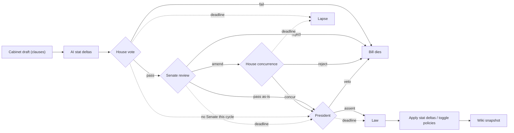
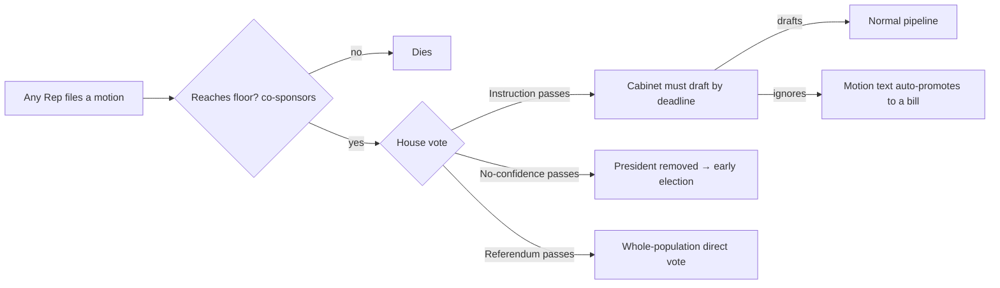
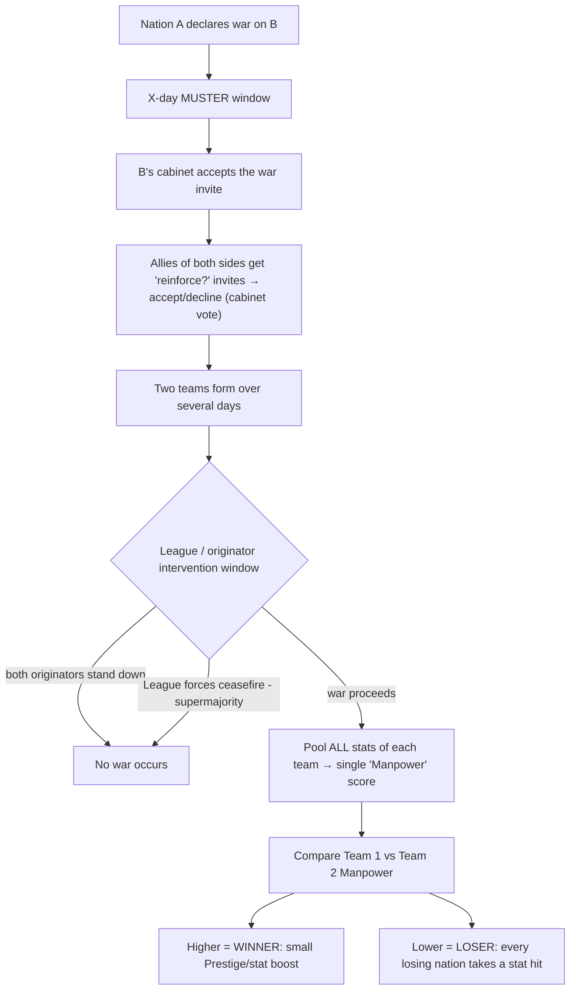

# Democracy Online v3 — Design Doc

> Working design captured from brainstorming. Decisions marked **DECIDED** are settled;
> **OPEN** items still need design. This doc is the source of truth for v3 direction.

## Vision

v3 turns Democracy Online from a single-nation idle/clicker into a **pure, multi-nation
political simulator**. Players hold a login account and create a separate **politician**
in each nation they join. Nations are player-created worlds with their own government,
laws, beliefs, stats, and history — all sitting beneath a global **League of Nations**.

The idle economy is gone. The game loop is now: **legislate → stats move → elections →
history is recorded.**

---

## Core decisions (DECIDED)

- **Multi-nation world.** Almost every game entity is scoped to a `nationId`.
- **Account ≠ Politician.** The login account is global; each politician is per-nation.
- **No raw image uploads.** Flags & avatars come from a curated SVG builder.
- **Create few, join many.** A player may create up to **3 nations** and join many.
- **Fully direct PR-STV voting.** The money-buys-votes idle loop is removed. Show percentages.
- **Finance system removed entirely.** No personal currency, companies, stocks, or markets.
- **Nation stats** are grouped: **categories → sub-stats**.
- **Everyone is a Representative by default** (House = whole population). Senate is elected.
- **Bills are structured into clauses**; amendments are clause-scoped.
- **Linear pipeline:** Cabinet drafts → House votes → Senate revises → (House concurs on edits) →
  President assents or vetoes. At most one return trip; on rejection/veto the bill dies.
- **Policies are national beliefs**, unlocked through bills, passive modifiers when enabled.
- **AI parses bill text into clamped stat deltas** (balance enforced by our clamping, not the model).

# Democracy Online v3 — Simple Summary

## The big picture

- Turns the game from a single-nation idle/clicker into a **multi-nation political simulator**.
- Core loop: **legislate → stats move → elections → history recorded**.
- The idle economy and all finance (money, companies, stocks) is **gone**.

## Accounts & politicians

- One **account** (login) can have many **politicians** — one per nation.
- **One politician per account per nation** (one-human-one-vote rule).
- Same person can hold office in several nations at once.

## Onboarding

- Full **guided tutorial** in a sandbox nation: try House, Senate, Cabinet, President, make a party, see a war and diplomacy, see the wiki.
- Tutorial ends by **forcing you to join the default nation "Oscana"** and make a politician there.
- After that you can **immediately create your own nation** (max **3 per account**).

## Nations

- Player-created, **public or private**, each with a name + **flag** (curated SVG builder, no uploads).
- Grow through a **stage ladder**: Founding → Cabinet → Assembly → Senate → Republic → Member State, unlocked by active-player count.
- Stages can revert if players leave (with anti-flapping safeguards); dead nations go **dormant → archived** (kept as lore).

## Government

- **House** = everyone (votes yes/no on bills).
- **Senate** = elected, refines bills.
- **Cabinet** = President-appointed, drafts bills (free-form roles, scales with population). The
  **President cannot draft** — their Cabinet does it for them.
- **President** = elected, appoints cabinet, toggles policies, **assents to or vetoes** finished bills.

## Bills

- Made of **clauses**; the Senate proposes **clause-scoped amendments** (one winner per clause, no conflicts).
- **Linear flow:** Cabinet drafts → House votes → Senate (pass / reject / amend) → if amended, one
  House concurrence vote → President assents or vetoes. At most one return trip; rejection or veto kills the bill.
- **AI scores stat impacts** (clamped for balance); a bill can move stats and unlock a policy.

## Motions (out-of-power power)

- Any Representative can file one (needs seconds to reach the floor).
- **Instruction** (compels cabinet — ignored ones auto-become a bill), **No-confidence** (removes President), **Referendum** (whole-population vote).

## Policies

- National **beliefs** (e.g. "gay marriage legal/illegal"), unlocked by bills.
- Passive stat modifiers when enabled; max **3 changes per 4-week presidential term**.

## Stats

- Grouped **categories → sub-stats**: Economy, Social, Stability, International.
- International = the three League metrics (Prestige, Trust, Belligerence).

## Elections

- **Direct voting**, ranked ballots, show percentages.
- **Senate = PR-STV** (seats = half the candidates); **President = IRV**.
- Senate term **2 weeks**, President **4 weeks**; no quorum; vacancies filled by **countback**.

## Parties & newspaper

- Create parties, recruit, platforms/stances, coalitions, merges.
- Party **newspaper**: members submit stories, leader curates, published as page-flippable issues.

## League of Nations

- Global body of **Member State** nations (gated by member count = anti-spam).
- **1 nation = 1 vote**, cast by **cabinet vote**.
- **Commend/condemn**, **sanctions**, **treaties** (peace + alliance), and **war**.
- **War** = muster two teams → pool stats into "Manpower" (hidden until reveal) → compare → winner gains, losers take a capped hit. Allies choose whether to join; League can force ceasefire.

## Wiki & history

- Every page is an **auto-generated encyclopedia entry** (nation, politician, party, bill, election, war) with history tabs.
- Live state + **immutable snapshots**; daily stat snapshots + **AI nation narrative**.
- Only human-written field is the **politician bio** (no moderation — accepted risk).

## Calendar

- Kept (bug-fix only), but **nation-scoped** — each nation has its own election schedule.

## Deferred for later

- Judiciary branch, national constitution/charter.

---

## 1. Identity model — Account vs Politician (DECIDED)

```
account (1) ──< politician (N) >── nation (1)
```

- **Account (global):** auth/login, display name, settings, optional cross-nation reputation.
- **Politician (per-nation):** name, avatar, role, party, voting record, bill history, stats.
- **One politician per account per nation (invariant).** An account may have many politicians,
  but **at most one in any given nation** — enforced as a uniqueness constraint
  `(accountId, nationId)`. This is the foundational anti-double-voting rule: one human = one
  House vote, one ballot, one seat per nation.
- The **same account can hold office in multiple nations simultaneously** (different politicians).
- Politician personas **do not leak across nations** to other players by default.
- **Admins can see the account↔politician linkage** for ban-evasion / moderation.

### Sockpuppet risk (accepted, with mitigation direction)

The entire game now rests on **one-human-one-vote** — direct House votes, STV elections, _and_
war Manpower all scale with account count. The `(accountId, nationId)` uniqueness rule stops a
_single account_ double-acting, but **multiple accounts** (sockpuppets) remain the biggest
systemic risk: one person running several accounts could stuff an election, dominate a small
nation, or pad a war team. v2's idle economy partly masked this (votes cost grinding); v3 makes
raw account count decisive.

Mitigation direction (not all required for launch):

- **Signup friction** — verified email / auth provider; one account per identity.
- **Activity gating** — a politician must meet a small activity bar before its votes count,
  raising the cost of spinning up throwaways.
- **Per-nation join friction** for small/private nations (founder review).
- **Admin linkage view** (already noted) for reactive enforcement of ban evasion.

Migration note: today `users` carries game state directly (`role`, `partyId`, `money`,
`lastActivity`). v3 splits this into `accounts` (auth) + `politicians` (per-nation state).

---

## 1b. Guided tutorial / onboarding (DECIDED)

Every new account is walked through a **fully guided, interactive tutorial** before being
dropped into the live game. v3 has many interlocking systems (motions, clause-based bills, STV,
policies, the League) — a new player must not face a blank dashboard. The tutorial teaches by
_doing_, inside a safe sandbox, then graduates the player into a real nation.

### Goals

- Get a player from signup to "I understand my role and what to do next" without reading docs.
- Teach the **core loop** (legislate → stats move → elections → history) through hands-on steps.
- Surface the player's **everyday levers** early: the House yes/no vote and **filing/seconding a
  motion** (so out-of-power players know they have agency from minute one).

### Flow

A single **scripted tutorial nation** with NPC politicians. The player is walked through **every
feature the game has**, experiencing what each role actually feels like, before being released.

1. **Create your politician.** Name + curated SVG avatar builder. Explains account ≠ politician
   (one politician per nation).
2. **Enter the tutorial nation.** A scripted sandbox with NPC politicians — nothing the player
   does affects live players.
3. **Role tour — see what each seat is like:**
   - **House** — cast a yes/no vote on a bill already on the floor; watch the tally resolve and
     **nation stats move**. File and second a **motion** (bottom-up agency).
   - **Senate** — propose a **clause-scoped amendment** to a House-passed bill and see it return to
     the House for a concurrence vote.
   - **Cabinet** — **draft a bill** (clauses), watch the **AI score stat deltas**, and unlock a
     **policy**.
   - **President** — appoint a cabinet role, toggle a policy.
4. **Create a party.** Found a party, set a platform/stance, see recruitment + the newspaper.
5. **War overview.** A short, scripted **muster-and-resolve** walkthrough — declare/reinforce,
   teams form, Manpower compared (the brinkmanship moment).
6. **Diplomacy.** A quick **League** pass — commend/condemn, a treaty, how cabinets vote.
7. **The wiki.** Show the auto-generated nation/politician page + history so the player sees
   everything is recorded.
8. **Graduate → forced join to the default nation** (below).

### Post-tutorial: forced join to the default nation

The tutorial does **not** drop the player onto an open menu. It ends with a **guided, forced
handoff** into the default nation so the player's first real action is already taken for them:

1. **Forced join.** A closing prompt — _"Now the tutorial is complete, let's join the default
   nation **Oscana**…"_ — and the player is **required to create a politician in Oscana** (name +
   avatar builder) before continuing. This guarantees every new player lands in one populated,
   healthy nation rather than a ghost town.
2. **Pointer to the wider world.** Immediately after, a closing message — _"You can click here to
   also join and create a politician in other nations…"_ — links them to the **Nations screen**.

### The Nations screen (reached after the forced join)

- A list of **joinable nations** — all **user-generated** — with the **default nation (Oscana)**
  pinned at the top (the player is already a member).
- The **"Create nation" button is active** — after the forced join the player **may immediately
  create their own nation** (up to the cap of 3). Spam is naturally contained: a fresh nation
  can't reach the world stage until it hits the **League member-count threshold** (§9), so empty
  vanity nations stay isolated and slide toward dormancy.

### Principles

- **Interactive, not a slideshow** — each step is a real action in the sandbox, not a wall of text.
- **Skippable but resumable** — experienced players can skip; progress is saved so a drop-off
  player can resume.
- **Contextual tips afterwards** — first time a player encounters a new system live (their first
  real election, first bill draft as cabinet), show a one-off inline explainer.
- **No real-world consequences** — the sandbox is isolated; tutorial actions never touch live
  nations, stats, or the League.

### Open tuning

- Whether the tutorial nation is per-player ephemeral or a shared scripted demo.
- Which systems are taught in-tutorial vs via contextual tips later.

---

## 2. Nations & lifecycle (DECIDED + OPEN)

- Each nation has a **name** and **flag**, editable by the President.
- **Flag/avatar builder:** curated SVG heraldry (emblem + layout + palette). No uploads →
  no moderation queue, no storage, no legal exposure, sharp at any size (wiki-friendly).
- **Creation cap:** up to **3 nations per account**. Joining is unlimited.
- **Lifecycle:** `forming → active → dormant → archived`, driven by active-politician count
  and recent activity.
  - Dormant/archived nations are **hidden from default browse** but **remain readable** as lore.
- **No founding gate** (DECIDED): after the tutorial's forced join to the default nation, a
  player **may immediately create their own nation** (up to the cap of 3). A founding gate is
  unnecessary because reaching the **League of Nations requires a member-count threshold** (§9) —
  spam/vanity nations simply never reach the world stage and slide toward dormancy. Abandoned
  nations are handled by the lifecycle + dormancy system.

### Progressive unlock & stage ladder (DECIDED + OPEN)

A nation starts as an autocracy and **gradually unlocks democratic institutions** as its
**active-politician count** crosses thresholds. The legislative loop is alive from player #1;
each later stage **adds a check** on the founder rather than introducing a new core mechanic.

**Active** = a politician with recent real-time activity (within N days). Only active
politicians count toward thresholds.

| #   | Stage            | Active threshold  | Newly unlocked                                                  | Effect on founder                              |
| --- | ---------------- | ----------------- | --------------------------------------------------------------- | ---------------------------------------------- |
| 0   | **Founding**     | 1                 | Draft & enact bills solo, policies, stats, flag, name           | Founder = President + entire government        |
| 1   | **Cabinet**      | 2                 | President appoints Cabinet; drafting can be delegated           | Founder shares drafting                        |
| 2   | **Assembly**     | 4                 | **House vote unlocks** — all Reps vote yes/no on bills          | Founder's bills now need House approval        |
| 3   | **Senate**       | 6                 | **Senate elections** (PR-STV) + clause amendments + concurrence | Founder loses unilateral text control          |
| 4   | **Republic**     | 9                 | **Presidential election** (IRV, single-seat); term limits begin | Founder must win an election to stay President |
| 5   | **Member State** | Republic + stable | **League of Nations eligibility**                               | —                                              |

> Thresholds are placeholders to tune.

**Progression is dynamic (can revert), with anti-flapping safeguards:**

- **Automatic, with notification** — small nations are never stuck waiting on a manual opt-in.
- **Hysteresis (asymmetric thresholds).** Unlock high, revert lower (e.g. unlock Senate at 6,
  don't revert until 4). The gap absorbs churn so a single login/logout can't flip a stage.
- **Grace countdown before reverting.** Dropping below the revert line starts a real-time
  countdown (e.g. 48–72h). Recover within the window → no downgrade. This is also the on-ramp
  to **dormancy**: a nation that can't sustain quorum slides toward `dormant` rather than
  violently downgrading.
- **Unlocking schedules an election with a candidacy/campaign window** — it does **not**
  instantly seat or depose anyone. When a stage unlocks, players **declare candidacy** during
  a campaign window, then voting runs. The founder serves as interim office-holder until the
  first election resolves.
- **Downgrades let in-flight processes finish first.** A bill mid-pipeline or an open election
  completes before the stage actually steps down.

---

## 3. Government structure (DECIDED)

| Body                         | Membership                             | Role                                |
| ---------------------------- | -------------------------------------- | ----------------------------------- |
| **House of Representatives** | **Everyone** in the nation (automatic) | Votes yes/no on final bills         |
| **Senate**                   | Elected (PR-STV), smaller              | Refines bills via clause amendments |
| **Cabinet**                  | Appointed by President                 | Holds the bill-drafting monopoly    |
| **President**                | Elected                                | Appoints cabinet, toggles policies  |

- PR-STV elections fill **Senate seats + the Presidency**. The House is not elected.
- Because everyone is a Representative, **no player is ever fully "out of power"** — all
  players always have a House vote.

### Cabinet composition (DECIDED)

- **Free-form, President-defined.** The President **creates, names, and removes cabinet roles**
  at will (role-play / flavour). There are no fixed portfolios.
- **All cabinet members have equal power:** any cabinet member may draft any bill. Portfolios are
  not tied to stat categories and carry no domain restriction.
- **Cabinet size scales with active population** (e.g. seats unlock as the nation grows), so a
  small nation can't put its entire population in cabinet and leave no out-of-cabinet majority.

---

## 4. Legislative pipeline (DECIDED)

Bills are **structured into clauses**. This is the key that makes amendments conflict-free. The
pipeline is **linear**: a bill moves forward through fixed stages with **at most one return trip**
(when the Senate amends), never an open-ended loop.

1. **Cabinet drafts** the bill (clauses). AI scores stat deltas (see §6). **The President cannot
   draft** — drafting is the Cabinet's job (the President appoints the Cabinet and may sit on it,
   but bills originate from Cabinet members, not the office of President).
2. **House vote:** all Representatives vote yes/no on the Cabinet's draft.
   - **Pass →** the bill goes to the Senate.
   - **Fail →** the bill dies.
3. **Senate (revising chamber):** the Senate reviews the House-approved bill and does exactly one of:
   - **Pass as-is →** straight to the President.
   - **Reject →** the bill dies.
   - **Amend:** senators propose **clause-scoped amendments**; the Senate votes; **one amendment
     wins per clause** (highest votes / first to threshold in the window). Conflicts are impossible
     by construction (amendments never share a clause). An amended bill goes **back to the House for
     a single concurrence vote** (step 4).
4. **House concurrence vote (only if the Senate amended):** the House casts **one** yes/no vote on
   the Senate's amended text — **no new amendments**. This is what reconciles editing with the
   House's approval: the House always ratifies the exact text that reaches the President.
   - **Concur →** to the President.
   - **Reject →** the bill dies.
5. **President:** **assent → law** (apply clamped stat deltas / toggle policies → wiki snapshot), or
   **veto → the bill dies**.

**Termination & inaction safeguards** (no stalls, no endless loops):

- **At most one return trip.** Because the only loop-back is a single House concurrence vote on a
  Senate amendment, a bill can never ping-pong indefinitely — there is no round cap to tune.
- **No Senate that cycle (0 senators):** the bill skips the Senate — Cabinet draft → House vote →
  President.
- **Per-stage deadlines** prevent inactive players stalling the pipeline:
  - **House inaction** (initial vote or concurrence vote) → bill **lapses**.
  - **Senate inaction** → bill **advances to the President unchanged**.
  - **President inaction** → bill **auto-assents** (an inactive President can't pocket-veto
    everything; the veto is an active choice).



- **OPEN:** Whether the AI re-scores stat deltas after each accepted amendment so the Senate
  sees the impact of its edits live.

---

## 4b. Motions — House-originated agency (DECIDED)

The **primary out-of-power mechanic** and a genuine **third source of power**. Cabinet's power
flows top-down (draft → chambers react); motions flow **bottom-up** — _any_ Representative can
initiate one, and the whole House decides. This makes the **House sovereign**, not just a
rubber stamp, and gives players who hold no office real teeth **without** having to build a party.
(Parties become the way you _win_ motions, not the only way to matter. This supersedes the
deferred "petitions" idea — same value, living inside the existing legislature.)

**Reaching the floor:** a motion needs **co-sponsors / seconds** before it gets a House vote
(anti-spam). Cooldowns prevent re-filing a failed motion immediately; a cap limits active motions.

| Motion type       | Threshold         | Effect if passed                                                                         |
| ----------------- | ----------------- | ---------------------------------------------------------------------------------------- |
| **Instruction**   | simple majority   | **Compels cabinet to draft a bill** on a topic by a deadline (agenda-setting from below) |
| **No-confidence** | **supermajority** | Removes the **President** → triggers an **early presidential election**                  |
| **Referendum**    | simple majority   | Escalates a yes/no question to a **whole-population direct vote**, bypassing cabinet     |

**Compel has hard teeth.** If cabinet ignores a passed Instruction motion past its deadline, the
**motion text auto-promotes into a bill** and enters the normal Senate → House pipeline — the
House legislates _over_ cabinet's head. Not ignorable theatre.

**No-confidence removes the President only** (not individual ministers) and triggers an early
election. (Distinct from §7's _inactive_-President rule, which is a passive cabinet caretaker — a
no-confidence motion is a deliberate removal.)

**Cabinet keeps a speed advantage** so it isn't made pointless: cabinet drafts directly and fast,
while motions are slower (second → vote → deadline → maybe auto-bill). Cabinet is the efficient
path; motions are the **override**.



> Casual/rank-and-file players also keep their permanent **House yes/no vote on every bill**, plus
> seconding motions and (party members) submitting newspaper stories. Ambitious players build
> parties to win motions and elections.

---

## 5. Policies — national beliefs (DECIDED)

- A **policy** is a value/position the nation officially holds
  (e.g. "Gay marriage is legal" vs "illegal").
- Policies are a **separate entity** from the party-stances system.
- Policies are **unlocked through bills** (a bill is the key; the policy is the door).
- When enabled, a policy applies **passive modifiers** to stats and to **International standing**
  (which is what lets the League commend/condemn).
- A **single bill can both move stats and unlock a policy.**
- A government may **introduce or revoke 3 policies per 4-week presidential term** — the
  nation's identity changes slowly.

---

## 6. Nation stats (DECIDED)

Structure: **categories → sub-stats**. The category score is a roll-up of its sub-stats.

| Category          | Example sub-stats                                                 |
| ----------------- | ----------------------------------------------------------------- |
| **Economy**       | growth, employment, treasury/debt, inflation                      |
| **Social**        | approval, equality, healthcare, education, crime                  |
| **Stability**     | corruption, civil liberties, unrest                               |
| **International** | Prestige, Trust, Belligerence (the three League metrics — see §9) |

- **Bills move sub-stats** via AI-generated, **clamped** deltas — balance is enforced by our
  clamping logic, not the model's goodwill. Cabinet selects which policies a bill introduces.
- **Policies** apply ongoing passive modifiers.
- Use the **TanStack AI package** with a cheap model that's good at writing/structured output.
- Homepage shows category roll-ups ("Economy: 62 ↑"); detail view shows the contributing sub-stats.

---

## 7. Elections (DECIDED)

Elections are **direct** — no idle accrual, no money, no vote-buying items. Both offices use
the **same ranked ballot**; only the count differs. Every Representative (the whole active
population) may vote.

### Counting method

| Office        | Seats    | Method                                                               | Why                                     |
| ------------- | -------- | -------------------------------------------------------------------- | --------------------------------------- |
| **Senate**    | multiple | **multi-seat PR-STV** (Droop quota, surplus + elimination transfers) | proportional, multi-winner              |
| **President** | 1        | **IRV / Alternative Vote** (single-seat STV degenerates to IRV)      | single winner, majority via elimination |

- **Ballot model:** **candidate-centric STV with party labels** (hybrid). Voters rank
  _individual candidates_; ballots show each candidate's party so voters can rank along party
  lines, but independents can win. Parties are coordination/labels, not list-controllers.
- **Display percentages:** show each candidate's vote share and how transfers flowed across rounds.
- STV Droop quota: `floor(votes / (seats + 1)) + 1`.

### Senate size — scales with turnout

- `seats = max(1, floor(candidates / 2))` — **half the candidates win** (round down).
- An **unopposed candidate is elected automatically**; **0 candidates → no Senate** forms that
  cycle and bills fall back to a straight House vote until one does.
- Consequence: the Senate's **size is volatile** week to week; the legislative pipeline must
  handle a variable-size chamber.

### Terms & cadence (real-time)

- **Senate term: 2 weeks.** **Presidential term: 4 weeks.**
- Staggered → **two Senate elections per presidential term** (midterm-style pressure; the Senate
  can shift under a sitting President).
- The **"3 policies per term" budget tracks the 4-week presidential term** (the President toggles
  policies).

### Eligibility & quorum

- **Anyone** (any Representative) may stand for Senate or President. No party requirement.
- **No quorum** — whoever votes decides. Low turnout self-corrects on the next election cycle and
  avoids small-nation deadlock.

### Vacancies

- **Senate:** refilled by **countback** — reuse the stored ranked ballots to seat the
  next-eligible candidate without a new vote (only possible because STV retains full ballots).
- **President goes inactive:** **no early election** — the **cabinet collectively exercises
  caretaker powers** until the 4-week term ends, then a normal election runs.

### Open tuning

- Candidacy-declaration window vs voting-window lengths (per the unlock flow in §2).
- Countback variant (re-run excluding the departed member vs. transfer their electing ballots).

---

## 8. Party newspaper (DECIDED)

- Party **members submit stories**; the **party leader curates/approves**.
- An issue requires a **minimum number of approved submissions** before it can be published
  (forces it to be a collective effort, not a one-person rag).
- Published as a **dated, immutable, page-flippable edition** with a real newspaper layout
  (masthead, columns). Editions are archived as primary-source lore in the wiki.

---

## 9. League of Nations (DECIDED)

The League is the **only system that creates inter-nation consequences** — without it,
nations are isolated sandboxes. It is a **maximal-stakes** layer: reputation, sanctions,
treaties, and war. Each is its **own subsystem** (not a single unified "resolution" object).

### Membership & structure (DECIDED)

- Members are **nations**, eligible only at the **Member State** stage (ladder #5), which
  requires a **minimum member count**. This is also the game's **anti-spam gate**: vanity nations
  created up to the per-account cap of 3 can't reach the world stage until they attract real
  members. Newcomers
  are shielded — they can't be condemned/sanctioned/warred before they can defend themselves.
- **Fully flat** — every Member State is equal, **1 nation = 1 vote**. No chair, no council tier.
- **Cabinets cast the vote.** Every League ballot triggers an **internal cabinet vote** in each
  member nation; the nation's single League vote is whatever its cabinet collectively decided.
- Nation-level acts that aren't League-wide ballots (declaring war, signing a treaty) **also**
  go through the internal cabinet vote.

### Internationals — cross-nation party blocs (DECIDED)

- An **International** is a **global ideological bloc of parties** (think real-world political
  internationals: a Socialist International, a Liberal International, etc.). It groups **parties from
  different nations** that share a platform.
- Internationals are **global**, not nation-scoped: a single International can contain parties from
  many nations. A **party affiliates with at most one International** (its leader opts in/out).
- **Member State gate:** only parties whose nation has reached **Member State** (stage #5 — the same
  threshold required to join the League) may affiliate. A nation below Member State **cannot join an
  International**; this reuses the League's anti-spam member-count gate, so Internationals only ever
  contain established nations (which by definition have a President + Cabinet).
- They are a **soft, cosmetic/diplomatic layer** — Internationals do **not** vote, hold power, or
  change game mechanics. They exist to show how ideological movements span the world and to give the
  League homepage a "who governs the world right now" scoreboard.
- **Delegates = executive power held by a bloc.** A nation's **President + Cabinet members** are its
  **delegates**. The **League of Nations homepage shows, per International, how many delegates**
  (Cabinet members + President, summed across every nation) belong to a party affiliated with that
  International. A bloc with many delegates currently controls a lot of the world's executive seats.

### League metrics (DECIDED)

Three bounded, decaying public metrics form the League scoreboard + inter-nation wiki history:

| Metric           | Up from                                                         | Down from                                              | Represents                                                           |
| ---------------- | --------------------------------------------------------------- | ------------------------------------------------------ | -------------------------------------------------------------------- |
| **Prestige**     | commendations, won wars, upheld treaties                        | condemnations, sanctions, lost wars, abandoning allies | Headline global reputation                                           |
| **Trust**        | honoring pacts, keeping treaties, brokering peace               | breaking treaties, aggressive war                      | Reliability as a partner — soft-gates who will ally with you         |
| **Belligerence** | declaring wars, proposing sanctions (decays over peaceful time) | peace, time without aggression                         | Visible warning flag; high Belligerence makes others wary of allying |

> Self-balancing brake: a warmonger can have **high Prestige but low Trust** — feared but
> friendless — making alliances harder to form without a hard rule.

### Subsystem 1 — Commendations & Condemnations (judgments)

- A member proposes; passes by **simple majority** (severity-scaled thresholds).
- **Commend** → bounded Prestige boost + badge on the target's homepage/wiki.
- **Condemn** → bounded, **decaying** Prestige penalty + mark.
- **Cooldown** (~1 week) before the same judgment can be re-proposed against the same nation.

### Subsystem 2 — Sanctions (coercion)

- Collective coercion: proposed against a target, passes by **supermajority** (it bites).
- Bounded passive penalty to the target's stats while active; **decays** and is **liftable** via
  a repeal vote; auto-expires after a long window so abandoned sanctions don't last forever.
- Can serve as **either** a non-violent alternative to war **or** a precursor that escalates to it.
- Aggressor-side standing cost discourages frivolous use.

### Subsystem 3 — Treaties (cooperation)

Two types, **ratified only by the signatories' cabinets** (non-signatories don't vote):

| Treaty                            | Effect                                                                                      |
| --------------------------------- | ------------------------------------------------------------------------------------------- |
| **Peace treaty** (non-aggression) | Declaring war on a co-signatory carries a heavy **Trust** + Prestige penalty                |
| **Alliance** (mutual-defense)     | Triggers the reinforcement chain in war (below); honoring builds Trust, abandoning costs it |

### Subsystem 4 — War (a discrete muster-and-resolve event)

War is **not** an ongoing attrition state — it is a one-shot event that musters, then resolves
by comparison. **The game has no armies**; a nation's _stats are_ its military strength.



- **Manpower = pooled stats only** (no population term). A team's Manpower is the sum of its
  members' stats. Well-governed nations win wars.
- **Mustering:** declaration opens an **X-day window**. Originators' **allies** receive a
  _reinforce?_ invite (mutual-defense pacts give a **casus belli**); each ally's **cabinet votes**
  to join or decline. **Declining an ally pays a Trust/standing penalty.**
- **Unlimited cascade, self-limited by choice:** allies-of-allies can be invited, with no hard
  depth cap — because every hop requires a cabinet to _choose_ to join, the chain only spreads as
  far as nations want it to. A world war is possible, but only by collective decision.
- **Manpower totals are HIDDEN until resolution.** Neither side knows who would win →
  the stand-down/intervention window becomes **brinkmanship** (bluffing & nerve), not a
  calculated decision.
- **Resolution is a single comparison.** Higher Manpower wins.
  - **Winner:** small, bounded Prestige/stat boost.
  - **Losers (all nations on the losing team):** stat hit that is **bounded, proportional to the
    margin** (narrow loss = small hit; blowout = bigger but capped), with a **recovery floor** so
    war can't drop a nation below a recoverable baseline. **No death spirals.**

### Peace (DECIDED)

- Because war resolves instantly, "peace" = **standing down during the intervention window**.
- **Both originating cabinets stand down → no war occurs.**
- The **League can force a ceasefire** before comparison via a **supermajority** resolution —
  this is the League's primary teeth and a key reason it exists.

### Anti-griefing guardrails (DECIDED)

- **Member States only** — newcomers shielded.
- **Severity-scaled thresholds** — sanctions/war-adjacent actions need supermajority.
- **All negative effects bounded + decaying** — no permanent crippling.
- **Cooldowns** on re-proposing failed condemns/sanctions.
- **Aggressor pays standing** — Belligerence rises, Trust falls, warmongering has a domestic price.
- **Loser hit has a recovery floor** — no death spirals.

### Open tuning

- Exact muster window length, vote windows (~48–72h starting point), cooldown lengths.
- Manpower formula weighting across stat categories.
- Whether a nation pulled toward **both sides** (allied to opposing belligerents) must pick one.

---

## 10. Wiki & history (DECIDED)

The "wiki" is **two layers**: a **history layer** (data — what happened, immutable) and a
**presentation layer** (typed entity pages that read like an encyclopedia, generated _from_ the
history). You never hand-write pages; they assemble themselves from game data.

### Storage model — live state + immutable snapshots (NOT event sourcing)

- **Live, mutable tables** hold _current_ state — a nation's stats now, current officeholders,
  active policies. (Stays close to the existing schema.)
- **Immutable point-in-time records** capture completed events that are done forever — a bill's
  final outcome, an election result, a war resolution. Write-once, never edited; these **are**
  the history.
- **Daily nation-stats snapshot** — a lightweight per-nation row written each day so stats can be
  **charted over time** (live tables only know "now"). Reuses the existing `candidateSnapshots`
  pattern. The **same daily tick regenerates the AI nation-narrative** (one job, two outputs).

### Page types — typed, auto-assembled entity pages

Pages are **structured and machine-generated**, not editable articles — which sidesteps
vandalism, edit wars, and moderation. Every page has an **auto-generated sidebar/infobox** and
**auto wiki-links** cross-referencing related entities (politician ↔ party ↔ bill ↔ nation).

| Page type      | Auto content                                                                    | History                                                                       |
| -------------- | ------------------------------------------------------------------------------- | ----------------------------------------------------------------------------- |
| **Nation**     | flag, government stage, officeholders, stats, active policies, **AI narrative** | every election, bill, policy change, war, League action                       |
| **Politician** | avatar, party, offices held, voting record, **human-written self-bio**          | career timeline across terms                                                  |
| **Party**      | platform/stances, members, election results                                     | leadership changes, merges, newspaper editions                                |
| **Bill**       | clauses, stat deltas, vote tallies, final status                                | full legislative journey (draft → House → Senate → concurrence → assent/veto) |
| **Election**   | candidates, results, STV transfer flows                                         | point-in-time event                                                           |
| **War**        | belligerents, teams, outcome                                                    | the muster timeline                                                           |

### Human-written vs generated content

- **Only one human-written field:** the **politician self-bio** (free text on their own page).
- **AI-narrated nation summary** sits over the auto infobox, regenerated daily; **overwrite —
  only the latest is kept** (no archived chronicle).
- Everything else is **auto-generated from data** — trustworthy, consistent, no moderation surface.

### Visual scope

- **Full-site wiki/encyclopedia redesign** — every page adopts the wiki aesthetic (infoboxes,
  cross-links, history tabs), not just a separate wiki area.

### Known risk (accepted)

- **The self-bio has NO automated moderation** (per decision). A public free-text field is a real
  abuse / legal-exposure surface (slurs, harassment, doxxing, illegal content). v3 ships the cheap
  mitigation as part of the **moderation MVP**: a **report button + moderator review queue** covering
  the bio and all other UGC (forum posts, DMs, newspaper, party/nation names). Recorded here so the
  trade-off (no pre-moderation, reactive removal) is a conscious choice.

### Open tuning

- AI narrative prompt/length and the exact daily-tick timing.
- Whether bill/election history tabs paginate or lazy-load for very active nations.

---

## 10b. Calendar (DECIDED)

- **Built from scratch for v3.** The v2 calendar is single-nation/global and is **not carried
  over**; v3 ships a new multi-nation calendar component.
- **Nation-scoped by design.** Today `getCalendarData()` is global (single-nation). In v3 each
  nation runs its **own election cadence**, so **different nations hold elections on different
  days** — the new calendar filters by `nationId` and reflects that nation's own schedule, derived
  from the election lifecycle windows rather than a global clock.
- Cadence is driven by the staggered terms from §7 (Senate every 2 weeks, President every 4 weeks), with
  each nation's clock starting whenever its stages unlocked — so two nations are rarely in sync.

---

## 11. Removed systems (DECIDED)

Deleted from v3 (roughly a third of the current schema):

- Personal currency / `money`, `lastActivity`-driven idle mechanics.
- `votesPerHour` / `donationsPerHour` accrual, `items`, `candidatePurchases`, donations.
- Entire finance stack: `companies`, `stocks`, `userShares`, `sharePriceHistory`,
  `shareIssuanceEvents`, `stockOrders`, `orderFills`, `financeKpiSnapshots`.
- Candidate idle tracking: `candidateSnapshots`, `donationHistory`, transaction histories.

---

## 12. Data model sketch (high level)

**New:** `nations`, `politicians`, `policies`, `nation_policies`, `nation_stats`,
`bill_clauses`, `amendments`, `motions`, `motion_seconds`, `motion_votes`, `newspapers`,
`newspaper_issues`, `newspaper_submissions`, `league_resolutions`, `league_commendations`,
`history_snapshots`, `forums`, `forum_threads`, `forum_posts`, `direct_messages`,
`notifications`, `reports`, `moderation_actions`, `internationals`, `party_internationals`.

**Changed / nation-scoped:** `accounts` (was `users`), `parties (+nationId)`,
`bills (+nationId, clause-based, linear stage machine)`, per-chamber bill votes,
`elections (+nationId, PR-STV)`, `candidates` (PR-STV).

**Kept (re-implemented):** party platform stances (`political_stances`, `party_stances`),
coalitions/merges, primaries.

**Reworked for v3:** external **bot API** (replaces v2 `access_tokens` / `api/bot.ts`) —
nation-scoped, scoped tokens, read-first. **Search** rebuilt as cross-entity (nations, politicians,
parties, bills, elections). v2 **chat** is replaced by **forums** (public per-nation boards +
private party boards) and **politician-to-politician DMs**; the v2 activity **feed** becomes a
read-only recent-events stream over the history log.

**Deferred (later):** judiciary branch, nation charter/constitution.

---

## 13. Build path — how we get there

v3 is a **full rebuild shipped as a single breaking release**, **not** an incremental migration:
**no v2 data is carried forward**, the world starts fresh, and **users sign up again** at cutover.
"Carried over" elsewhere in this doc means a v2 **concept** re-implemented on the clean schema, not
an in-place migration of rows.

Suggested build sequence (see `docs/V3_TICKETS.md` for the full milestone/epic breakdown):

1. **Foundations.** New project skeleton on the existing stack (TanStack Start, Drizzle, Firebase
   Auth), clean schema skeleton, auth, server-fn + test patterns, UI/design language, contract
   stubs.
2. **Identity.** `accounts` (auth) + `politicians` (per-nation), `(accountId, nationId)`
   uniqueness — built fresh, not split from `users`.
3. **Core political loop.** Nations + lifecycle, clause-based bills + linear pipeline, PR-STV/IRV
   elections, nation stats, policies, AI bill scoring — with history capture wired in from day one.
4. **Social & meta systems.** Parties + newspapers, League of Nations, wiki/history, forums + DMs,
   search, activity feed, notifications, reworked bot API.
5. **Integration + scheduled tick**, then the **guided tutorial**, then **cutover** (v2 retired).

The removed v2 systems (§11) simply do not exist in the new codebase — there is nothing to migrate.

---

## Open questions parking lot

- Time model confirmed: **real-time (hours/days)**, not discrete turns.
- Exact stage thresholds + hysteresis gaps + grace-period length to tune (§2).
- Live AI re-scoring after each amendment? (§4)
- Election tuning: candidacy vs voting window lengths; countback variant (§7).
- League: muster window length, Manpower formula weighting, dual-side conflict edge case (§9 tuning)
- History storage decided: live state + immutable snapshots (not event sourcing); AI nation
  narrative + daily stat snapshots (§10). Tuning: narrative prompt/length, history pagination.
- Judiciary / charter — deferred; revisit after core loop. (Petitions superseded by motions, §4b.)
- Calendar: **built from scratch** for v3 and **nation-scoped** so each nation shows its own
  election schedule (different nations vote on different days) (§10b).
- Social/platform systems decided (see `docs/V3_TICKETS.md`): forums (public per-nation + private
  party) + politician DMs (replacing v2 chat), cross-entity search, a recent-events feed over
  history, a notifications system (account + in-game politician scopes, incl. private-nation
  invites), and a reworked nation-scoped bot API. **Admin/moderation: a moderation MVP ships at
  launch** — admin/mod roles, a report button on every UGC surface, a review queue, content removal,
  and account bans; private DMs are mod-viewable only when reported.
